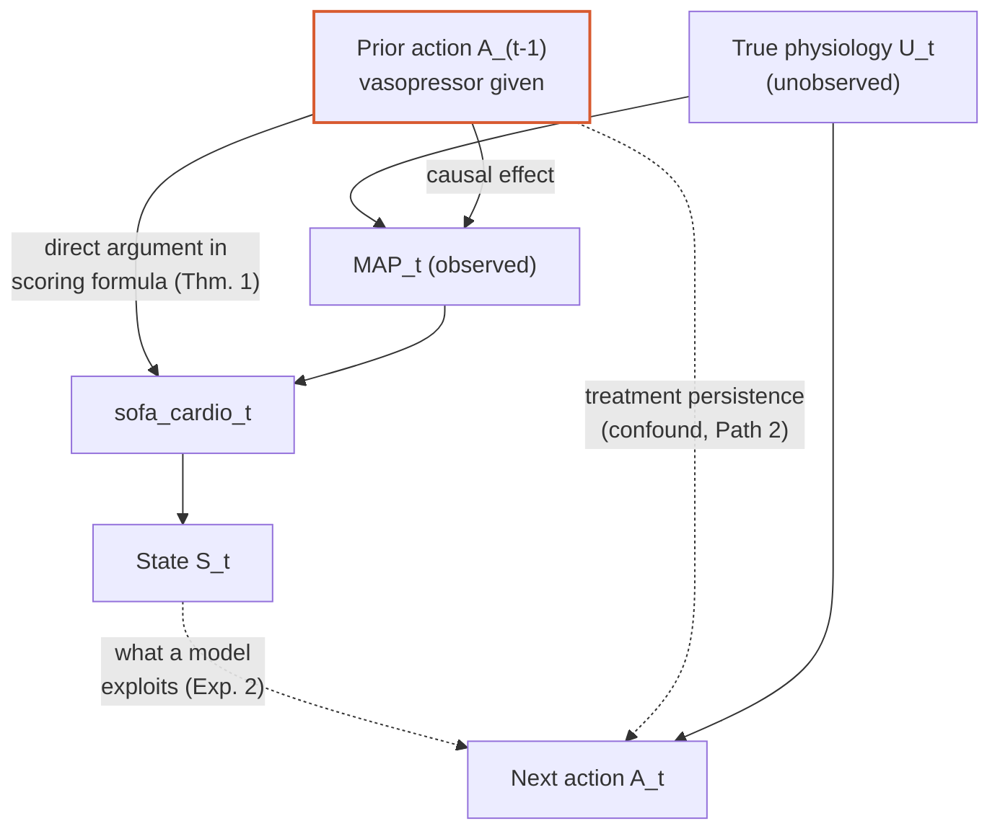

# A Formal and Causal Analysis of State–Action Information Leakage in Sepsis Reinforcement Learning

**Theoretical foundations and pre-registered predictions for the empirical audit in this repository.**

Companion to [`ROADMAP.md`](ROADMAP.md) (what's been run and verified) and the manuscript draft in
[`paper/`](paper/) (where these results are written up for publication).

---

## Abstract

Offline reinforcement learning for sepsis treatment learns a policy from a state representation
built substantially from the SOFA organ-dysfunction score. We show that this construction admits
two provable failure modes — a scoring-rule non-identifiability (the cardiovascular subscore is
not recoverable from physiology alone once a treatment threshold is crossed) and a
window-overlap mechanism whose behavior, contrary to naive intuition, is *not* monotonic in
window length, for reasons we derive from first principles. We then place both mechanisms in a
causal graph and show that the resulting state variable is formally a *descendant* of the prior
treatment action — a structural fact, independent of any classifier's performance, that explains
why an empirical predictability gap (Experiment 2) is necessary but not sufficient evidence that
these specific mechanisms, rather than ordinary treatment persistence, drive the gap. We close by
stating the disambiguating test as a falsifiable,
pre-registered decision procedure (Experiment 5), so the planned experiments confirm or refute a
concrete prior prediction rather than being interpreted after the fact.

---

## 1. Introduction

Three claims are under audit in this project:

- **H1 (treatment-confounded severity construction):** the SOFA cardiovascular subscore's own
  construction encodes the prior treatment action directly, not only through its physiological
  effect.
- **H2 (treatment overlap):** temporal aggregation windows overlap prior treatment periods, carrying
  treatment-derived information into the state via timing alone.
- **H3 (recoverability reflects these mechanisms specifically):** the AUROC gap between a full state
  and a state with no explicit treatment features (Experiment 2) reflects H1/H2's mechanisms
  specifically, rather than ordinary treatment persistence unrelated to SOFA.

Sections 3–4 prove H1 outright. Section 5 proves the provable part of H2 and gives a rigorous
account of where it stops being provable. Section 6 formalizes the causal structure that makes H3
an open question, and states the exact test (already implemented in this repo's Experiment 5) that
will resolve it — framed as a pre-registered prediction, not a post-hoc interpretation.

### 1.1 A terminology note (H1/H2 were previously labeled "leakage" — corrected)

H1 and H2 were originally framed as forms of "leakage." That framing conflated two structurally
different causal patterns, and this section states the corrected distinction precisely, since every
later section depends on it.

```
Ordinary sequential decision-making (what H1/H2 actually are):
    A_(t-1) --> S_t --> A_t
    prior action shapes the state, which then informs the NEXT decision.

True (ML-sense) leakage (what H1/H2 are NOT):
    A_t --> S_t --> Â_t
    the state contains information about the SAME action epoch it is used to predict,
    or information not yet available at decision time.
```

H1 and H2 are both instances of the first pattern: $\sigma_{cardio,t}$ and window-overlap content
are functions of $A_{t-1}$ (or earlier), used to predict $A_t$ — a *later* action. That is ordinary
treatment history informing state, the structure every sequential decision process has. It is a
genuine problem for offline-RL state design regardless — a state that is a near-deterministic
function of the *prior* action, independent of physiology, still threatens the causal assumptions
policy learning relies on (Proposition 2, §6.2) — but it is a **post-treatment-bias / bad-control**
pathology from causal inference (conditioning on a variable affected by treatment; Hernán & Robins,
§6.2's Remark), not a **target/temporal leakage** pathology from machine learning. The two have
different fixes: leakage is fixed by correcting an indexing/alignment bug (as in Tang et al. 2026,
"Off by a Beat" — a different mechanism from either H1 or H2, see `papers.html`); treatment
confounding is fixed by disentangling or explicitly modeling the treatment-history term, not by
re-indexing anything.

The analysis notebook's Section 7 ("Build State Variants A–E and Action Labels") verifies directly
that this project's own action label (`action_next`) is built exclusively from treatment events
strictly *after* the state's own observation window closes, with zero overlap — i.e., the second
(true-leakage) pattern does not occur anywhere in this pipeline. H1 and H2 are retained under their new names because the underlying
mathematics (Theorems 1–2, Proposition 1) is unaffected by what the mechanisms are called; only the
word "leakage" — reserved from here on exclusively for the second pattern above, which this project
does not currently claim to have found — has been retracted from H1/H2's names.

---

## 2. Formal setup and notation

- ICU stay $i$, decision times $t = 1, \dots, T_i$ in 4-hour bins.
- $A_{t}$: binary indicator, vasopressor active in the interval following decision point $t$ (the
  code's `action_next`).
- $S_t$: the state vector at decision time $t$, built from a lookback window $[t-w, t)$.
- $U_t$: the patient's true, unobserved physiological state at time $t$.

A well-posed offline-RL state should satisfy: $S_t$ is not a near-deterministic function of
$A_{t-1}$ in a way that lets a model recover $A_t$ through $A_{t-1}$'s influence on $S_t$ alone,
independent of what $S_t$ says about $U_t$. This is the property both mechanisms below threaten.

---

## 3. Theorem 1 — Non-identifiability of the SOFA cardiovascular score

### 3.1 The scoring function

The cardiovascular SOFA subscore (Vincent et al., 1996) is scored by checking dose thresholds from
highest to lowest, falling through only if the higher tier doesn't apply — the branches are nested,
not independent, which resolves an OR/AND ambiguity present in an earlier draft of this document:

$$
\sigma_{cardio}(\text{MAP}, D) =
\begin{cases}
0 & \text{if } D = \emptyset \text{ AND MAP} \geq 70 \\
1 & \text{if } D = \emptyset \text{ AND MAP} < 70 \\
4 & \text{if } \text{dopamine} > 15 \text{ OR epinephrine} > 0.1 \text{ OR norepinephrine} > 0.1 \\
3 & \text{else if } \text{dopamine} > 5 \text{ OR } 0{<}\text{epinephrine}{\leq}0.1 \text{ OR } 0{<}\text{norepinephrine}{\leq}0.1 \\
2 & \text{else if } 0{<}\text{dopamine}{\leq}5 \text{ OR dobutamine} > 0
\end{cases}
$$

$D$ is drawn from the treatment record — a function of the action history, not of physiology. This
matches the audited implementation (`sofa_cardio_decomposed` in the analysis notebook) exactly.

### 3.2 Theorem 1

**Statement.** For any fixed nonzero drug/dose $D=d$ — any vasopressor active, at any dose —
$\sigma_{cardio}$ is constant in MAP: $\sigma_{cardio}(m_1,d)=\sigma_{cardio}(m_2,d)$ for all
$m_1,m_2$. This holds for the entire nonzero-dose domain, not merely where a dose exceeds some
threshold — none of the three nonzero-dose branches above reference MAP at all.

**Proof.** Inspect the three non-zero branches directly — none contains MAP as an argument. Fix $D
=$ dopamine at 6 mcg/kg/min (no epinephrine or norepinephrine active). The highest tier
(dopamine$>$15) is false; the next (dopamine$>$5) is true, giving score $3$. For any
$\text{MAP} \in \{40, 55, 70, 90, \dots\}$, $\sigma_{cardio}(\text{MAP}, D) = 3$ identically. Two
physiologically opposite states (severe hypotension vs. normotension) map to an identical score.
This is exhaustive over the branch's domain — settled by the function's definition, not by
sampling. $\blacksquare$

**Corollary 1.1 (exact, not merely observed).** Dose branches yield scores in $\{2,3,4\}$; the
$D=\emptyset$ branches yield scores in $\{0,1\}$ — disjoint ranges. So whenever $D\ne\emptyset$
(any nonzero dose, not conditional on crossing any particular cutoff), the dose-derived score
exceeds the MAP-only score, and $S_t$'s cardiovascular-subscore feature is a deterministic function
of $A_{t-1}$, independent of $U_t$. The claim that "100% of treated timesteps are dose-determined"
is therefore a direct consequence of the category structure, not a coincidence requiring empirical
confirmation. *Empirical content, kept separate:* the frequency at which $D\ne\emptyset$ occurs at
all — 32.3% (4h window) / 28.6% (24h window) of eligible timesteps overall, 100%
among already-treated timesteps. The frequency is an empirical count; Theorem 1 is what makes the
count possible, and would remain true even if the empirical frequency were different.

---

## 4. Theorem 2 — Reconstructibility under naive feature removal

$\text{sofa\_total} = \sum_{i=1}^{6} \text{subscore}_i$ is a deterministic linear sum over six organ
subscores including $\sigma_{cardio}$.

**Statement.** Removing $\sigma_{cardio}$ from the feature set while retaining
$\text{sofa\_total}$ (state variant C) does not remove the information $\sigma_{cardio}$ carries.

**Proof.** $\sigma_{cardio} = \text{sofa\_total} - \sum_{i \ne cardio} \text{subscore}_i$. Every
term on the right-hand side is observable in variant C. The reconstruction is an algebraic
identity, exact rather than approximate. $\blacksquare$

**Corollary 2.1 (necessity of variant D's correction).** A feature-removal scheme defeats Theorem 2
only if it removes or recomputes *every* quantity from which $\sigma_{cardio}$ is reconstructible —
in particular, $\text{sofa\_total}$ itself must be recomputed from a treatment-independent
cardiovascular proxy, not merely left in place after $\sigma_{cardio}$ is dropped.

*Empirical confirmation:* variant C's AUROC (0.885) sits close to the full state's (0.900),
consistent with near-total reconstructibility. Variant D — which recomputes $\text{sofa\_total}$
from a MAP-only cardiovascular proxy, per Corollary 2.1 — drops to 0.792, close to the floor set by
variant E, which has no explicit treatment features (0.791). The theorem predicts this pattern; the
notebook confirms it.

---

## 5. Treatment overlap: what is provable, and a corrected account of what is not

### 5.1 Definitions

For decision point $t$ with lookback window $w$, let $O_t(w)$ denote total treatment-hours
overlapping $[t-w, t)$ (summed over every treatment interval intersecting the window). Define the
overlap fraction — the share of the window itself that prior treatment occupies (not a claim about
ML-sense leakage; see §1.1):

$$c_t(w) = \min\left(1,\ \frac{O_t(w)}{w}\right)$$

### 5.2 Proposition 1 (monotonicity of absolute overlap)

**Statement.** For $w_1 < w_2$: $O_t(w_1) \leq O_t(w_2)$.

**Proof.** $[t-w_1, t) \subset [t-w_2, t)$ — the windows are nested. $O_t(w)$ is the measure of
treatment time intersecting a set that only grows as $w$ increases, and measure is monotone under
a growing measurable set. $\blacksquare$

### 5.3 Remark — why the *fraction* is not similarly monotonic

An earlier draft of this analysis incorrectly treated $c_t(w)$ as inheriting Proposition 1's
monotonicity. It does not, and the correct account is more interesting than a hand-wave: $c_t(w) =
O_t(w)/w$ is a ratio of a monotone non-decreasing numerator (Prop. 1) to a strictly increasing
denominator. Differentiating,

$$\frac{d c_t}{dw} \propto \frac{d O_t}{dw} - \frac{O_t(w)}{w} = \frac{dO_t}{dw} - c_t(w)$$

so $c_t(w)$ is *increasing* at $w$ precisely when the marginal treatment density in the
newly-included slice $[t-w-dw,\ t-w)$ exceeds the average density accumulated over $[t-w, t)$ so
far — exactly the relationship between a marginal curve and an average curve familiar from basic
calculus (a marginal-cost curve crossing an average-cost curve raises the average). This is a real,
provable local condition, not an artifact.

**Consequence.** No monotonic relationship between $w$ and $c_t(w)$ should be expected a priori.
Aggregating the population-level statistic $P(c_t(w) > 0.5)$ over heterogeneous patients — each
with a different treatment-density profile — compounds this further, since the aggregate is a
nonlinear functional of a quantity that is already non-monotonic per patient. The empirical
reversal observed in this project (34.3% of decision points $>50\%$ overlapping at $w=4$h, versus
28.7–30.8% at $w=24$h across runs) is **consistent with, not contradictory to**, this framework —
it is exactly the kind of pattern Proposition 1 plus the marginal/average relationship predicts can
occur, not a bug in the pipeline.

### 5.4 What remains provable at the limits

- $w \to 0^+$: if $t$ falls strictly inside an ongoing treatment interval, $c_t(w) \to 1$.
- $w \to \infty$: for any patient with nonzero treatment history before $t$, $c_t(w) \to 1$ once
  $w$ exceeds the full elapsed stay duration.

Both are direct consequences of the definitions in §5.1 and do not depend on any distributional
assumption about treatment patterns.

---

## 6. The causal structure of H3, and why it is not provable in closed form

### 6.1 The causal graph

$$
\begin{array}{c}
U_t \longrightarrow \text{MAP}_t \\
A_{t-1} \longrightarrow \text{MAP}_t \quad \text{(causal: vasopressors raise blood pressure)} \\
A_{t-1} \longrightarrow \sigma_{cardio,t} \quad \text{(direct: Theorem 1)} \\
\text{MAP}_t \longrightarrow \sigma_{cardio,t} \\
\sigma_{cardio,t} \longrightarrow S_t \\
A_{t-1} \longrightarrow A_t \quad \text{(clinical treatment persistence, unrelated to SOFA)} \\
U_t \longrightarrow A_t \quad \text{(clinician responds to true state)}
\end{array}
$$

*(Rendered interactively earlier in this conversation; Mermaid source for GitHub rendering is in
§6.4.)*

### 6.2 Proposition 2 — $S_t$ is a descendant of $A_{t-1}$

**Statement.** There exists a directed path $A_{t-1} \to \sigma_{cardio,t} \to S_t$ in the causal
graph.

**Proof.** Direct from the edge set in §6.1 (the first is Theorem 1's causal expression; the second
is $S_t$'s definition as including $\sigma_{cardio,t}$ as a feature). $\blacksquare$

**Remark.** This is not a novel causal-inference finding in the abstract — using a variable
affected by treatment as a nominally "pre-treatment" covariate is a well-documented source of bias
(Hernán & Robins, *Causal Inference: What If*, on conditioning on variables affected by treatment).
What this project contributes is the *specific, provable graph edge* (Theorem 1) that makes $S_t$ a
descendant of $A_{t-1}$ in this particular clinical-RL setting, and a way to quantify how much of a
predictive model's power flows through that edge.

### 6.3 Why Proposition 2 does not settle H3

A classifier trained to predict $A_t$ from $S_t$ (Experiment 2) cannot, from its AUROC alone,
attribute its performance between two structurally distinct paths:

- **Path 1:** $A_{t-1} \to \sigma_{cardio,t} \to S_t$ — the treatment-confounded pathway
  (Theorem 1), bypassing $U_t$ entirely.
- **Path 2:** $A_{t-1} \to A_t$ — ordinary clinical treatment persistence, unrelated to SOFA or any
  feature in $S_t$.

An elevated AUROC is *consistent with* Path 1 but does not rule out the classifier picking up Path
2's signal indirectly, since patients further along a treatment course have both an elevated
$\sigma_{cardio,t}$ *and* a higher chance of continued treatment — correlated through $A_{t-1}$
without $S_t$'s treatment-confounded construction doing any of that work. **This is why H3 is a
conjecture, not a theorem, and
why it requires an experiment rather than a proof.**

### 6.4 Mermaid source (renders on GitHub)



---

## 7. Conjecture (H3) as a pre-registered, falsifiable prediction

Rather than interpret Experiment 5's output after the fact, we state the decision procedure in
advance, matching the criterion already embedded in the notebook (`notebook/`, Section 10, cell
25) — noting explicitly that encoding this threshold *before* running the experiment is itself a
form of pre-registration worth preserving in the manuscript.

Let $\text{AUROC}(k)$ denote the offset-decay AUROC at offset $k \in \{0, 1, 2, 4, 8\}$ decision
bins (Experiment 5b). Define:

$$\Delta = \text{AUROC}(0) - \text{AUROC}(8)$$

**A methodological correction.** Checking whether the marginal confidence intervals for
$\text{AUROC}(0)$ and $\text{AUROC}(8)$ overlap is not the correct test, and is a known-weak
heuristic in general: these two AUROCs are computed on the *same* patients, so their sampling
errors are correlated, not independent — non-overlap of two marginal CIs is neither necessary nor
sufficient for $\Delta$ being credibly different from zero. The correct target is the sampling
distribution of $\Delta$ itself, obtained via a **paired cluster bootstrap**: resample patients
(not timesteps) with replacement, and on each resample compute both $\text{AUROC}(0)$ and
$\text{AUROC}(8)$ using that same resampled patient set, recording $\Delta$ for that resample.
Repeating this many times yields a bootstrap distribution for $\Delta$ directly. A DeLong-type
paired test for correlated ROC curves, or a permutation test that permutes offset-labels within
patient, are valid alternatives.

**Prediction A (Path 1 dominates — the treatment-confounded pathway drives the gap).** If the paired-bootstrap CI
for $\Delta$ excludes a value near zero and $\Delta \geq 0.10$, this supports H3: the
predictability measured in Experiment 2 substantially reflects the definitional/window mechanisms
proven in Sections 3–5, not merely persistence.

**Prediction B (Path 2 dominates — persistence confound).** If $\Delta$'s bootstrap CI includes 0,
or $\Delta < 0.10$, this indicates ordinary treatment persistence explains most of Experiment 2's
gap — itself a real, reportable finding (and consistent with the manuscript's own account of why
the original single-offset test, AUROC 0.862 at 8h, was ambiguous and prompted this redesign), not
evidence that Theorems 1–2 are wrong. Theorems 1 and 2 remain true regardless of this outcome; only
their *practical contribution to Experiment 2's specific AUROC gap* would be smaller than currently
estimated.

**What would falsify H3 outright:** a flat decay curve ($\Delta \approx 0$ across all offsets)
combined with variant E (no explicit treatment features) already matching variant A's AUROC — which would imply
the SOFA-specific mechanisms in Sections 3–5, while mathematically real, contribute negligible
*practical* predictive power in this cohort. This has not occurred in results so far (E vs. A gap
= 0.109, confirmed), so this falsification condition is not currently met, but it is stated here as
the explicit failure mode this framework commits to.

---

## 8. Summary: proof status of every claim

| Claim | Status | Nature |
|---|---|---|
| Theorem 1 (treatment-confounded severity construction exists) | **Proven** (§3.2) | Mathematical fact about the scoring function's domain |
| Corollary 1.1 ("100% of treated timesteps") | **Proven** | Direct consequence of disjoint score ranges, not merely observed |
| Theorem 2 (variant C insufficiency) | **Proven** (§4) | Algebraic identity |
| Corollary 2.1 (variant D necessity) | **Proven**, confirmed empirically | Follows from Theorem 2 |
| Proposition 1 (absolute overlap monotonicity) | **Proven** (§5.2) | Measure-theoretic |
| §5.3 (fraction is not monotonic) | **Proven** | Marginal/average calculus relationship |
| §5.4 (limiting-case overlap) | **Proven** | Direct from definitions |
| Proposition 2 ($S_t$ descendant of $A_{t-1}$) | **Proven** (§6.2) | Graph-theoretic |
| H3 (AUROC gap reflects these mechanisms specifically) | **Open — Conjecture, §7** | Requires Experiment 5's decay-curve test |

Only H3 is genuinely undetermined. A reviewer can verify every proof in Sections 3–6 by reading the
scoring rule and the graph — none require trusting code execution. This is worth stating plainly in
the manuscript's Discussion: the paper's contribution rests on proofs for two of its three claims,
with the third resolved by a pre-registered, falsifiable experimental design rather than
post-hoc interpretation.

---

## 9. References

- Vincent, J.-L. et al. (1996). The SOFA (Sepsis-related Organ Failure Assessment) score to
  describe organ dysfunction/failure. *Intensive Care Medicine*, 22(7), 707–710.
- Hernán, M. A. & Robins, J. M. *Causal Inference: What If*. Boca Raton: Chapman & Hall/CRC, 2020.
  (Cited for the general principle in §6.2's Remark; full citation to be finalized alongside
  ROADMAP.md Phase 5's literature pass.)
- Komorowski, M. et al. (2018). The Artificial Intelligence Clinician learns optimal treatment
  strategies for sepsis in intensive care. *Nature Medicine*, 24(11), 1716–1720. (Motivating
  application, per manuscript Section 2.)

---

## Appendix: notation

| Symbol | Meaning |
|---|---|
| $t$ | Decision time (4h bin index) |
| $A_t$ | Vasopressor action following decision point $t$ |
| $S_t$ | State vector at $t$ |
| $U_t$ | True, unobserved physiology at $t$ |
| $D$ | Active drug/dose (function of treatment history) |
| $\sigma_{cardio}$ | SOFA cardiovascular subscore |
| $w$ | Lookback window length (hours) |
| $O_t(w)$ | Treatment-hours overlapping window $[t-w, t)$ |
| $c_t(w)$ | Overlap fraction, $\min(1, O_t(w)/w)$ |
| $k$ | Offset (decision bins) in Experiment 5's decay curve |
| $\Delta$ | Decay slope, $\text{AUROC}(0) - \text{AUROC}(8)$ |
