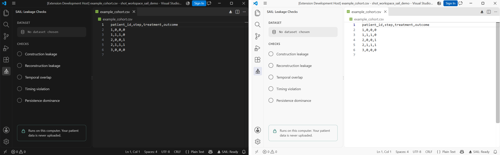

# SAIL for VS Code

Check a treatment dataset for state-action information leakage, with plain-language results. Everything
runs on your computer: your patient data is never uploaded.

> **Status: in development (Phase 3 of 6).** The setup wizard picks a real dataset, reads its real columns
> and runs the real, installed `sail-leakage` package through a local Python process. What it shows when a
> check finishes is a plain-text placeholder, not the five-card results view -- that arrives in Phase 4.



## What is in it

* **SAIL panel** (sail icon in the activity bar): the dataset, the five checks and the privacy note, drawn
  with your theme's colors and fonts. A loading skeleton shows until the panel has its content
  ([screenshot](docs/screenshots/loading-skeleton-dark.png)).
* **Status bar**: the sail icon and *SAIL: Ready*. Click it to open the panel.
* **Editor title bar**: a sail button next to the split-editor button, and **SAIL: Check a dataset** in the
  Command Palette (Ctrl+Shift+P).
* **Get Started walkthrough** (Command Palette: *SAIL: Get Started*): choose data, confirm columns, read
  the report ([screenshot](docs/screenshots/walkthrough-dark.png)).
* **Move it to the right**: drag the sail icon to the right-hand side of the window, or run *SAIL: Move to
  Secondary Side Bar* and choose *Leakage Checks*, then *New Secondary Side Bar Entry*
  ([screenshot](docs/screenshots/secondary-sidebar-light.png)).
* **The setup wizard** (*SAIL: Check a dataset*, or the welcome screen's *Start a check*): pick a CSV or
  Parquet file from the workspace or browse for one, confirm SAIL's auto-detected columns
  ([screenshot](docs/screenshots/wizard-map-dark.png)), choose which of the five checks to run, and it calls
  the installed `sail-leakage` package in a local Python subprocess. *Try with example data* runs the exact,
  independently verified worked example from `SAIL_PACKAGE_README.md`'s Quickstart
  ([screenshot](docs/screenshots/wizard-flagged-dark.png)) -- nothing here is a mock.

### Two honest limits of the wizard right now

* **A real file gets a real "not run".** The wizard's four generic fields (patient ID, time step,
  treatment, outcome) are enough to read a file's columns, but not enough for most of what
  `sail.check()` needs -- a scoring function, which columns were removed versus retained, treatment
  intervals, or a fitted AUROC are not derivable from column *names* alone. So checking your own file
  will usually report all five categories as "not run", each with the exact reason
  ([screenshot](docs/screenshots/wizard-not-run-dark.png)) -- `sail.check()`'s own honest behavior, not a
  bug. Picking richer specs from a real file arrives in a later phase.
* **The result screen is a placeholder.** It prints `report.summary()` as plain preformatted text. The
  five result cards, per-check sidebar icons, a status bar issue count and the HTML export are Phase 4.

## Try it (development)

1. In VS Code choose **File → Open Folder…** and open this `extension` folder.
2. Run `npm install` once in a terminal there.
3. Press **F5**. A window titled *[Extension Development Host]* opens with only SAIL loaded, and the
   debugger is attached to it (set breakpoints in `src/`). Click the sail icon in its activity bar.

No debugger needed? Run the task **SAIL: open test window (no debugger)** (*Terminal → Run Task*).

### Why F5 is set up this way

VS Code's own extension launcher attaches its debugger to the test window using the address `localhost`.
On machines where `localhost` resolves to IPv6 (`::1`) first, the test window's debug port is not listening
there, so the connection is refused hundreds of times and VS Code reports *"Extension host did not start in
10 seconds, it might be stopped on the first line and needs a debugger to continue."* That is not a SAIL
problem, and it affects any extension.

So F5 here runs the **Debug SAIL** configuration instead. It first runs the task *SAIL: open test window
(debuggable)*, which opens the test window with its debug port on `127.0.0.1` (IPv4), and then attaches to
exactly that address. The original launcher is still there as *Run SAIL (VS Code's launcher)* if you prefer it.

* The tasks run the `code` command, not VS Code's executable directly. `code` exits as soon as the window
  is open; the executable does not, which leaves F5 stuck on "Waiting for preLaunchTask".
* Debug port `5870` must be free. If a previous test window is still open, close it first.
* The tasks send the test window to the VS Code you ran them from. If you start VS Code with a custom
  `--user-data-dir`, add the same flag to the two tasks.

### How long it takes

Measured with F5 pressed in a throwaway VS Code (your settings and extension folder copied, not modified):

| | No extensions | 36 extensions loaded |
|---|---|---|
| Test window opens | 6.2 s | 10.3 to 14.4 s |
| **SAIL and the status bar item are active** | **11.7 s** | **16.5 to 22.3 s** |
| Panel content shown after you open it | about 0.2 s | 0.2 to 0.4 s |

SAIL itself activates in under 10 ms and needs about 0.2 s to draw the panel. Nearly all of the wait is VS
Code creating a new window, which is slower when many extensions are loaded in the window you launch from.

## Build and test

| Command | What it does |
|---|---|
| `npm run bundle` | Bundle `src/extension.ts` into one file, `dist/extension.js` (about 0.3 s). This is what F5 runs first. |
| `npm run typecheck` | Type-check without emitting (about 5 s). |
| `npm run build` | Type-check, then bundle. |
| `npm run build:icons` | Rebuild the icon font `media/sail-icons.woff` from `media/icons/*.svg`. |
| `npm test` | Start a real VS Code with a throwaway profile and run the integration tests. Set `VSCODE_EXE` to an installed `Code.exe` to avoid a download. |

### Testing the Python integration

The four tests in `pythonIntegration.test.ts` call the real `sail_bridge.py` and, through it, a real
installed `sail-leakage` -- nothing about them is mocked. A bare checkout has no such interpreter, so they
look for one exactly the way the extension itself does (`sail.pythonPath`, the Python extension's selected
interpreter, then `python3`/`python` on PATH) and **skip with a clear message** if none is found, rather
than failing:

```
SAIL_TEST_PYTHON=/path/to/python/with/sail-leakage npm test
```

`sail.pythonPath` is set only inside the test's own throwaway profile; your real settings are untouched.

## Repository rules

* Fixtures and screenshots use synthetic data only, never real patient data.
* The repository's pre-commit hooks must pass (`python -m pre_commit run --all-files`).
